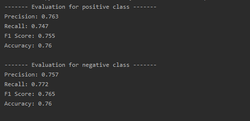
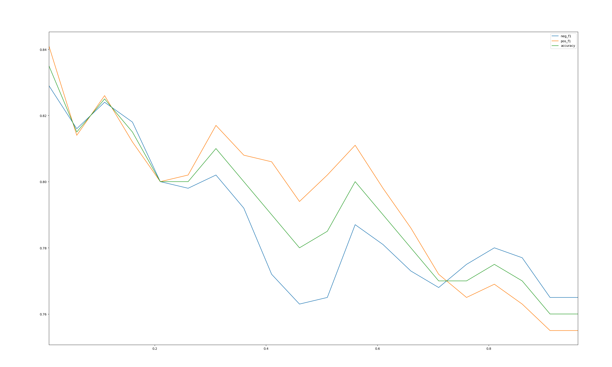
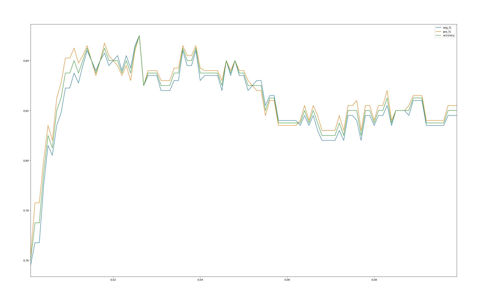
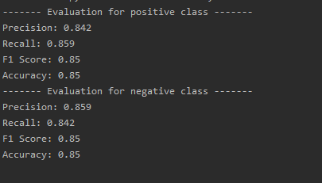

# Naive Bayes Classifier and Evaluation

### Heyuan (Henry) Gao

## Program Instruction

### 1. Training Function

To collect the word counts, we need to first split the text in the training set. In this case, I used regular expression **'[^A-Za-z\\']+'** as the seperator. Specifically, it will discard all non-letters except for single quote because some word with quote may have different meanings such as "I'm", "That's", etc.

Then, the class initialization was changed. I used set to collect all the features instead of using dictionary, and added a new variable *class_count* to collect class counts. Inside the train function, it can visit every seperate word and generate word counts based on the document's class. Accordingly, it will caculate the priors and likelihoods.

### 2. Evaluation Function

This function will generate precision, recall, f1 score and accuracy for both positive class and negative class. If the mode is 'print', the function will print out all the results based on the class, otherwise the function will return f1 score for both class as well as accuracy for further analysis (in this case, for grid search, which will be mentioned latter).

### 3. Feature selection

I applied the mutual information to select features. By this function, I calculated mutual information (also called information gain) for each word in the training set. Afterwards, the function will choose a specific number of the words with top mutual infomation. The number of choosing words would be based on user defined selection rate (a ratio from 0 to 1).

### 4. Grid Search Function

This is an add-on function for selecting the best feature select rate. This function will take a list of select rates as input. It will use the selected feature to train and test model, print and plot the evaluation results.

## Result Analysis

### 1. Raw Result

At the beginning, I trained the model without feature selection (you may set selection rate as 0 to verify the result). The evaluation result is as followed.

Then, I implement grid search to find the best select rate and get the following results. These two plots have select rate as X-axis and evaluation result as Y-axis (f1 in both negative and positive class as well as accuracy)

Select rates in the first plot are from 0.01 to 0.99 with step size 0.05. And I found the model performed well in small selection rate. So in the second plot, I chose select rate from 0.001 to 0.1 with step size 0.001. Finally, I got the best selection rate 0.026 which means there will be 1010 words in the selected features. The evaluation of my Naive Bayes model with the best feature set is shown below.

