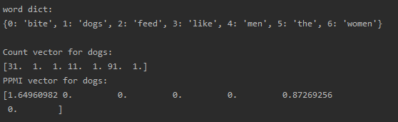
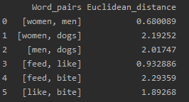
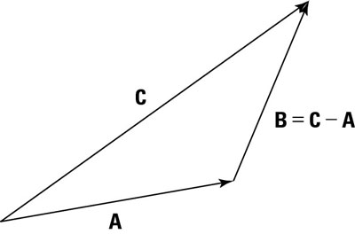
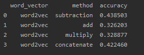

# CS114 (Spring 2020) Programing Assignment 5

## Distributional Semantics Takes the SAT

### Heyuan (Henry) Gao

## 1 Create distributional semantic word vectors

### Program Introduction

Program details can be seen in Section_1.py. 

In this section, I created a class *Embedding* to complete all the functions needed where *word_to_vector* function can generate the co-occurrence matrix and PPMI matrix based on the small artificial corpus. Additionally, function *get_word_vector* is used to print both the count vector and PPMI weighted vector according to the word input. Function *euclidean_distance* can compute euclidean distance between any two words in the corpus. 

### Compare the word vector before and after PPMI reweighting

The difference between original count vector and PPMI weighted vector for 'dogs' is shown below:

As we can seen in this result, PPMI set 0 value in context words including 'dogs', 'feed', 'like', 'men' and 'women'. These are consistent with count vector (mostly count for 1) except for 'like' (count for 11), which makes sense because we are using co-occurrance based on bigrams and from the corpus we could not see many "('dogs', 'like')"s. 

Most importantly, it is very excitiing to see that word like 'the' has the less value (0.87) in PPMI vector even though with very high word counts (91) comparing to 'bite' (1.65), because 'the' usually could not provide much information in normal corpus. Overall, the PPMI vector is intuitively better than the original count vector by outstanding the obviously related word 'bite'. 

### Euclidean Distance

Compute the distance between the following word pairs, note that here I applied PPMI word vector:

    “women” and “men” (human noun vs. human noun)
    “women” and “dogs” (human noun vs. animal noun)
    “men” and “dogs” (human noun vs. animal noun)
    “feed” and “like” (human verb vs. human verb)
    “feed” and “bite” (human verb vs. animal verb)
    “like” and “bite” (human verb vs. animal verb)

The results is as followed:

From the table, similar word pairs tend to have less euclidean distance. For example, 'women' and 'men' has a short distance of 0.68 comparing to 'men' and 'dogs' with the distance of 2.02. This result confirms our intuition from distributional semantics.

### Singular-value decomposition (SVD)

The following results are PPMI original matrix and recovered matrix, where the two matrix share the same value except for zero values which may be due to the precistion loss of floating-point.

### Reduced PPMI matrix

After reducing the dimensions to 3 on PPMI matrix, I calculated a new euclidean distance table (shown below):

The result keeps the information we need for each word vector because it still confirms our intuition that similar words appear in similar contexts and they have shorter euclidean distance between each other.

## 2 Computing with distributional semantic word vectors

### Programming

Program details can be seen in Section_2.py.

Function *create_test_set* randomly chose 1000 line from synonymous verbs with replacement, and for each verb, picked 4 random non-synonyms from the data set. Also, set the data set as the answers for multiple-choice questions. This function only ran once since I stored the test set and corrected answers as csv files (test_set.csv, test_correct.csv). Therefore, for the rest of the code, you could simply run *load_test_set* function to repeat the results. Note that there may be some unknown word in the test set, *get_word_vector* function could deal with the unknown word by making it a zero array, because the unknown words bear no context from training set so that we could assume they are unrelated to other words. Here I add a really small value (1e-16) on the unknown word vector to avoid error in calculating the cosine similarity. Accordingly, this function will return the word vector. 

*test* function collects the accuate numbers of synonymous word predictions including two method, euclidean distance and cosine similarity. To simplify my code, I used cosine distance to represent similarity (cosine distance = 1 - cosine similarity). The prediction word is the one having shortest distance to the base word. 

In order to solve SAT Analogy questions, I created a new class inheriting *Embedding*. I rewrote the *create_test_set* and *test* functions to manage the new data set and added a new function *create_vector* which can help me conveniently create new vectors by any method function.

### Synonym detection

The following table contains the accuracy among different set of word vectors and different distance methods:

It is obvious that word2vec set performs better than COMPOSES and cosine similarity method lead to a higher accuracy. 

### SAT Analogy

In this case, we need to figure out which word pair is the best match to the based word pair, easy to think about calculating the distance between each word pair and find out the closest one to the distance value of based pair. Intuitively it comes to my mind that I could continue applying cosine distance method based on the word2vec set of word vectors since it performs well in synonym detection. However, after checking the data set, I found cosine similarity may not be applied directly here because it ignores the direction between the two words. For example, in the second question from the data set (listed below), I believed "ostrich bird" and "primate monkey" shared similar cosine distance but it is obviously a wrong answer.

    ostrich bird n:n
        lion cat n:n
        goose flock n:n
        ewe sheep n:n
        cub bear n:n
        primate monkey n:n

So, the direction between two word vectors is important here. Accordingly, I consider the subtraction of two word vectors because it indicates the change (direction) between two vectors explaned by the following figure. After generating this new subtraction vector, I could still use cosine similarity to figure out how close among those new vetors.

Therefore, I created subtracted new vector and surprisingly got a high accuracy at 0.438. This exciting finding encouraged me to apply more methods on creating new vectors, such as adding, multiplying, concatenating. And I gained the following results:

First of all, these methods all have significant higher accuracy than the random guessing (20%). Another interesting part is that concatenating method also brings a high accuracy (0.422). The reason I think may be that concatenating vectors contain all the information from the paired vectors, concatenating does not change anything on the two vectors, the advantage of which is protecting the information but at the same time the data is kind of redundant. In my opinion, the concatenating method is a good baseline model in analogy. Comparing to concatenating, subtracting, adding and multiplying methods all convert the information to a new form, which intuitively thinking may cause information loss. However, subtraction decribes the direction between two vectors. Because it emphasizes this essential part though losing some other information, we could expect a higher accuracy with this method. The performance of the rest two methods, adding and multiplying, are not very saticfying. This phenomenon is similar to feature reduction or engineering, new information from these methods is not enough to make up for lost information. 

