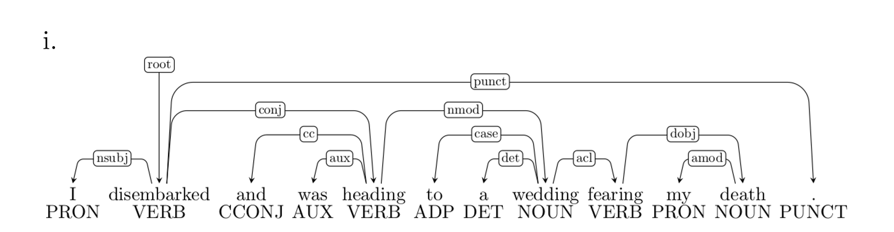
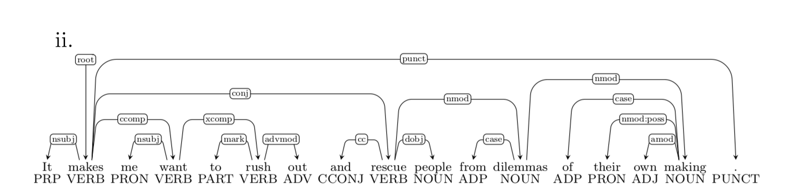
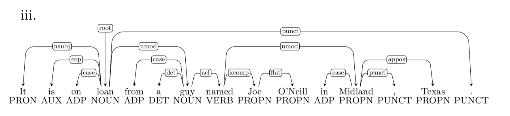
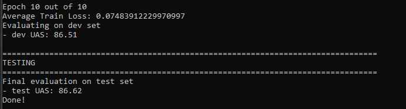
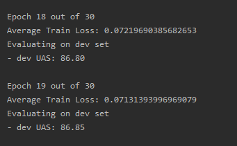

# CS114 (Spring 2020) Programing Assignment 6

## Neural Transition-Based Dependency Parsing

### Heyuan (Henry) Gao

## Worked Example

### 1. Go through the sequence of transitions

Given the sentence:

    I parsed this sentence correctly

Stack | Buffer | New dependency | Transition
:-- | :-- | :-- | :--
[ROOT] | [I, parsed, this, sentence, correctly] |  | Initial Configuration
[ROOT, I] | [parsed, this, sentence, correctly] |  | SHIFT
[ROOT, I, parsed] | [this, sentence, correctly] |  | SHIFT
[ROOT, parsed] | [this, sentence, correctly] | parsed $\rightarrow$ I | LEFT-ARC
[ROOT, parsed, this] | [sentence, correctly] |  | SHIFT
[ROOT, parsed, this, sentence] | [correctly] |  | SHIFT
[ROOT, parsed, sentence] | [correctly] | sentence $\rightarrow$ this | LEFT-ARC
[ROOT, parsed] | [correctly] | parsed $\rightarrow$ sentence | RIGHT-ARC
[ROOT, parsed, correctly] | [] |  | SHIFT
[ROOT, parsed] | [] | parsed $\rightarrow$ correctly | RIGHT-ARC
[ROOT] | [] | ROOT $\rightarrow$ parsed | RIGHT-ARC

### 2. A sentence containing $n$ words will be parsed in how many steps

For each word of the sentence, it need first be shifted onto the stack and then reduced by right\left arc. Therefore, there would be $2*n$ parsing steps for a sentence containing $n$ words regardless of the initial configuration.

### Check Dependencies Error

Dependencies Error:

    Prepositional Phrase Attachment Error
    Verb Phrase Attachment Error
    Modifier Attachment Error
    Coordination Attachment Error

Given four sentences, each one has one dependency error from above. 

Error type: Verb Phrase Attachment Error
Incorrect dependency: wedding $\rightarrow$ fearing
Correct dependency: heading $\rightarrow$ fearing

Error type: Coordination Attachment Error
Incorrect dependency: makes $\rightarrow$ rescue
Correct dependency: rush $\rightarrow$ rescue

Error type: Prepositional Phrase Attachment Error
Incorrect dependency: named $\rightarrow$ Midland
Correct dependency: guy $\rightarrow$ Midland

Error type: Modifier Attachment Error
Incorrect dependency: elements $\rightarrow$ most
Correct dependency: crucial $\rightarrow$ most

## Neural Network Program

### Instruction

In *parser_model.py*, weight matrices contain the weight of bias term, so the shape of which is added 1 on rows (first dimension). Also, of the outputs from *forward* function, the last column (second dimension) of hidden layer outputs is filled with ones representing bias term. 

In terms of *train_for_epoch* in *run.py*, I take advantage of numpy broadcasting. For each sentence, the backpropagation for all layers is $\nabla_lL=x_l\odot\delta_l$, since we are applying the sum of gradients from one minibatch, my code alters this formula into $\nabla_lL=X_l^T\cdot\Delta_l$, where $X_l$ is the input matrix of current layer with shape of (batch size, input features) and $\Delta_l$ is the error term matrix with shape (batch size, output features). The dot product would be the summation of gradients aggregating by batch size.

### Model Training and Evaluation

With the default hyperparameters (hidden_size=200, lr=0.0005, epoch=10), I got the following results:

Then, I implemented a simple grid search on debug mode. First, I changed learning rate to 0.001 to achieve a quick convegence. Accordingly, with differents set of hidden_size and epoch, the grid search results are as bellow:

hidden_size/epoch | 100 | 150 | 200 | 250 | 300 | 400
-- | -- | -- | -- | -- | -- | --
10 | 0.238   62.22 | 0.215   68.63 | 0.232   66.95 | 0.271   59.91 | 0.220   65.02 | 0.227   65.24
20 | 0.213   67.21 | 0.144   68.84 | 0.279   65.99 | 0.190   57.46 | 0.182   66.09 | 0.120   73.86
30 | 0.136   70.85 | 0.121   73.91 | 0.132   74.96 | 0.150   70.57 | 0.123   67.50 | 0.132   73.04

The best parameter set is epoch=30, hidden_size=200. After about 20 epoches, the loss and UAS did not change a lot and the result is not much better than 10 epoch

Then, I tried hidden_size=400, due to the time limitation, I have only run 6 epoches and the final result is as below:

It is slightly better than above results, but not very much.